```{r setup, include=FALSE}
knitr::opts_chunk$set(echo = TRUE)
```


## Introduction

High quality catch data is a pillar of fisheries management around the world. Catch data is central to enforcing quota systems and is a critical input to fisheries management models, both to understand the biomass removed from the population and as an indicator of the stock health. While stock assessments remain the gold standard for evaluating the sustainability of a fishery, full stock assessments are cost-prohibitive in many locations and at the frequency necessary. Catch data therefore remains a critical input piece of data for data-poor stock assessment and when paired with with fishing effort, serves as an indicator of catch sustainability (Carruthers et al. 2012). 

Illegal, unreported and underreported (IUU) fishing by its nature results in an underestimate of catch, posing a data and management problem. IUU fishing represents an estimated $10-23.5 billion and 11-26 million tonnes of catch annually, with total catch estimated to be 40% higher in some regions than reported catch (Agnew et al. 2009). In addition to undermining fisheries management, IUU fishing has been associated with human rights abuses, and drug, weapon and wildlife trafficking (Ewell et al. 2017; Chapsos and Hamilton 2019; Miller et al. 2019). 

One issue that can result in an underestimate of catch, therefore resulting in underreported catch or creating a pathway through which other IUU fish can be landed or imported, is through the application of low live weight conversion factors. In general, the weight of fish caught is not measured directly. Instead, catch is typically estimated by multiplying the weight of fish landed, often after some amount of processing (e.g., removal of head or guts) that reduces the weight, by a "live weight conversion factor". For example, 1000 tonnes of landed fish with an associated live weight conversion factor of 1.2 would result in an estimated 1200 tonnes of catch. Converting landings to the live weight equivalent is necessary because patterns in landed weight will vary substantially with differences in processing prior to landing. The resulting live weight equivalent of the landed weight serves as the catch estimate reported in standard international databases. 

Noteably, seemingly small numerical differences in live weight conversion factors can result in large differences in estimated catch. For example, if we take the 1000 tonnes of landed fish from above and instead apply a live weight conversion factor of 1.8, we would estimate 1800 tonnes of catch, or an additional 600 tonnes. As discussed later in this report, live weight conversion factors for a single product can vary substantially more than in this example. Yet, despite the fact that applying different live weight conversion factors will dramatically shift estimated catch, live weight conversion factors are not generally reported alongside estimated catch. Further, once catch is aggregated by species or taxonomic group, the information on processing at landing is lost, making it impossible to reestimate catch using a different set of live weight conversion factors from the catch data alone. As a result unreporeted live weight conversion factors represent a set of critical underlying assumptions in catch data that inhibit data reproducibility and transparency. 

Following the FAO Coordinating Party on Fishery Statistics, within this report, the landed weight refers to the weight of product at the time of landing, regardless of the state (e.g., fresh or frozen) and presentation (e.g., whole, gutted, filleted, etc.), the product weight refers to the weight of a product at the time of weighing, and the nominal catch refers to the landings converted to a live weight basis. Since fishery products can be landed in diverse states and presentations, which dramatically alter the weight, catch statistics are reported as nominal weight in international statistics. In order to convert from landed weight to nominal weight, a live weight conversion factor must be applied. The conversion to nominal weight enables better catch comparison across space and time since it incorporates differences in state and presentation. At the same time, the application of live weight conversion factors can introduce error when the factors do not accurately represent processing losses. Additionally, nominal catch only represents the live weight equivalent of the fishery products landed and therefore cannot be used to directly evaluate the gross catch, which includes not only the retained catch, but also the discarded catch. 

The EU catch certificate program aims to improve catch reporting in order to deter IUU fishing and guarantee that seafood sold within the EU is of legal origin. To improve the catch reporting, the Commission implementing regulation (EU) No 404/2011 outlines which live weight conversion factors should be used for catch landed in or exported to the EU. For landings by Regional Fisheries Management Organizations, of which the EU is a Contracting party or cooperating non-Contracting party, or in areas where the EU has an agreement to fish in third country waters, the conversion factors defined by the Regional Fisheries Management Organization or third-party nation apply. Otherwise, the conversion factors set by the EU are to be used when available. In cases where no EU or regional conversion factors exist for a given species and presentation, the conversion factor adopted by the flag Member State applies. Finally, imported seafood products are subject to a separate set of issues related to live weight conversion factors, stemming from both the different potential set of conversion factors and the fact that the EU cannot generally require non-EU countries to use the conversion factors set by the EU.

The objectives of this report are to:

1. Demonstrate how inconsistencies in how the live weight of fish is calculated leads to “missing landings” of processed seafood landed in the EU;

2. Estimate the potential extent of reporting inconsistencies caused by the use of differing conversion factors;

3. Demonstrating how a lack of information on third country conversion factors (non-RFMO species) and the aggregation under trade codes could impact the back-calculation to live weight;

4. Identify what the strengths and/or weaknesses are in the use of terminology on the catch certificates; and

5. Provide policy recommendations on catch certificate reporting terminology and improvements to the application of live weight conversion factors.

## Methods

### Data

*Live weight conversion factors*

Live weight conversion factors for this analysis were compiled from four sources. First, the official EU-wide live weight conversion factors for fresh, salted, and frozen products were recorded from the European Commission's Regulation (EU) No 404/2011 Annexes XIII, XIV, and IV, respectively. Second, Member State live weight conversion factors were recorded from the European Commission's EU fishery control system Table 2 (<https://ec.europa.eu/fisheries/cfp/control/conversion_factors_en>). The Member State live weight conversion factors refer only to quota species. Therefore, we also included live weight conversion factor data from the Food and Agriculture Organization to expand the data coverage and to include values for non-EU countries. Finally, we compiled conversion factors from the national fisheries authorities of the Faroe Islands, Greenland, and Norway (i.e., "third countries" that follow certain EU fishery regulations, but are not part of the EU: https://ec.europa.eu/fisheries/cfp/control/conversion_factors_en)

*Landings data*

Landings data of all fishery products landed in the ports of European Economic Area (EEA) countries come from Eurostat's online database (https://ec.europa.eu/eurostat/data/database). While both quantity (tonnes) and value (Euro) are reported, we focus on quantity for this report since we are able to use conversion factors to backcalculate nominal catch. On the other hand, we are unaware of any analogous conversion factor that we could apply to the landings value in order to get the original value of the unprocessed catch. 

Landing quantities also report various states (e.g., Fresh, Salted, Dried, etc.) as well as presentations (e.g., Whole, Fillet, Gutted, etc.), which are relevant for matching landings data to the appropriate conversion factors. Landings quantities are reported annually. When we present time series data, we show the full range of available data from 1992 to 2018. In some cases, we only present a snapshot of the data (e.g., when we compare the national vs EU-wide conversion factor for a single species' state and presentation). For these snapshots, we present the most recent year available for each case study, and no earlier than 2016.

*Trade data*

For the trade case study, we use the United Nations' Comtrade BACI data (a standardized international trade database) to provide an example of how the variability in conversion factors is exacerbated when dealing with internationally traded products. We focus on the import of frozen mackerel from South Korea into the European Union. This product is officially catalogued in the Harmonized Commodity Description and Coding System (HS) as HS code 030354. All products with this code number fall under the description "frozen, mackerel (scomber scombrus, scomber australasicus, scomber japonicus), excluding fillets, livers, roes, and other fish meat." The problem of different countries having different conversion factors for a given species product form, is compounded by the fact that the HS codes by which internationally traded products are reported also contain multiple species. Products entering the European Eunion with HS code 030354 therefore may be matched to different conversion factors based not only on country variability but also species variability. 

### Analysis

Landed weight must be multiplied by the corresponding live weight conversion factor in order to estimate the pre-processing weight of the catch (i.e., the live weight equivalent). The live weight conversion factor can have a large impact on the estimated catch and it is therefore important that the landed weight be matched to the appropriate live weight conversion factor, based on the species, presentation and state of the landed product (Figure 1). 

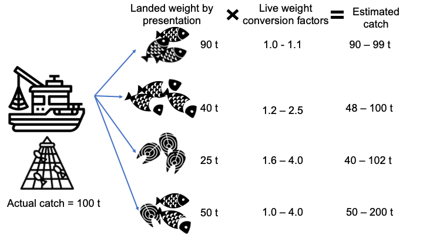

The objective of the analysis is to illustrate the impact of different live weight conversion factors on calculated catch using case study examples. The case studies were selected to illustrate 1) the differences in the application of EU-wide versus Member State values and the range in values across the EU; 2) the differences in the application of EU versus non-EU conversion factors, and; 3) the additional challenges with the application of conversion factors to trade data. Case studies were selected on the basis of there being a wide range in the reported live weight conversion factors. Additionally, live weight conversion factors had to match available landings data for countries being compared.

In the first step, we evaluated the ranges in live weight conversion factors and coverage of live weight conversion factors at the EU and Member State levels. To do this, we matched conversion factors by species, presentation and state. We then calculated the range in conversion factors for each species-presentation-state, in both absolute ($max-min$) and relative ($max/min$) terms. The absolute difference indicates the range in values that may be applied, while the relative difference indicates the potential extent of impact on the calculated catch. For example, take one product with conversion factors ranging from 3.0-4.5 and a second ranging from 1.0-2.0. The first has a wider range of live weight conversion factors (1.5 compared to 1.0) while the second has a larger relative difference (1.5 compared to 2.0). In this example, 100 tonnes of product would mean an estimated catch of 300-450 tonnes in the first case, but 100-200 tonnes in the second case. We then plotted these ranges, identifying within the plots which points represent EU-wide, EU Member State, and non-EU values. 

Comparing catch estimates resulting from applying different live weight conversion factors requires not only a range of reported live weight conversion factors, but also that the live weight conversion factors are provided by the countries landing the product (not only for the species, but also the correct presentation and state). Therefore, we evaluated the coverage of conversion factors throughout the EU. To do this, we calculated the proportion of countries that report landings of a given product that also report a live weight conversion factor. We then also identify which products landed within the EU have an EU-wide conversion factor. 

Once the conversion factor data were matched to landings data, we were able to identify candidate case studies based on the range of relevant conversion factors and the volume of landings. These selection criteria enable illustration of large differences in estimated catch volume based on real landings and alternate live weight conversion factor data. 

## Live weight conversion factor ranges and data coverage

Comparing the live weight conversion factors across species-presentation-state combinations landed in the EU reveals substantial variability for some products (Figure 2). The largest range is for the family *Lophiidae*, frozen, headed and gutted, which ranges from X to Y [Kelvin - add], representing a ##% difference in catch estimates (Figure 2). [Kelvin, can you add ~2 more examples with the numbers here (any of the top ones is fine)?] 


Notably, while there are substantial differences in live weight conversion factors for products landed in the EU, this does not necessarily mean that one of the values is incorrect. Within a product for a family, such as *Lophiidae*, live weight conversion factors can vary across species and a country may set a value that is most representative of the most common species caught. Additionally, live weight conversion factors can vary with differences in processing technology, which may also vary geographically or over time. 

While both values could be correct, it could also be the case that neither is correct. First, since live weight conversion factors can vary with differences in processing technology, any given value could become outdated if these values are not maintained. Second, if there is any tendency to use live weight conversion factors to underrepresent catch, the tendency would be to set lower live weight conversion factors. 

When considering just the official conversion factors implemented by the European Commission's Regulation (EU) No 404/2011 for EU-wide and Member State fisheries products, and merge this with all products landed by fishing vessels from the 27 EU countries, we see considerable data gaps that hinder our (and the EU's) ability to calculate nominal match for these landed product (Figure 3). Part of this stems from the fact that the presentations listed by the European Commission do not properly align with those found in Eurostat's landings data (supplementary? Table X [Kelvin - sure! Add to the Appendix]) as well as a list of all species present in the landings data for which there is currently no EU-wide or national-level CF value. 


![a: Grid showing the top 50 species by landed weight in the EU (accounts for 87.1 % of total landings from 1992 - 2018). Gray areas are species, states, and presentations that are not landed. (A) Shaded blue areas represent the proportion of all countries that reportedly landed a species, state, and presentation (i.e., product) that also have a national-level conversion factor for that product. (B) Green areas represent products that have an EU-wide level conversior factor. Pink areas represent products that have no EU-wide level conversion factor.](Images/Section - CF ranges and data coverage/CF_natonal_values_heat_map.png)

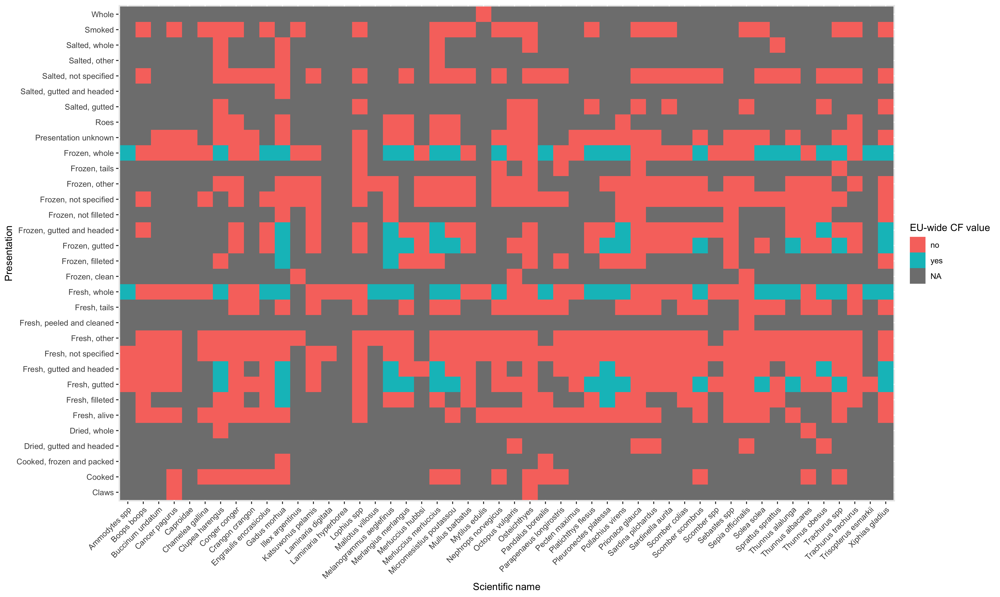


## EU Fishery Case Studies

Below are several case studies focusing on three species of economic importance to the EU: cod (*Gadus morhua*), hake (*Merluccius merluccius*), and Monkfish (*Lophiidae*). For this analysis, we include the CF values from Norway's National Fisheries Authority. Although Norway is not part of the EU, they do follow certain fisheries regulations outlined by the European Commission. For the same reason, we attempted to include the national CF values of Greenland and the Faroe Islands, but were unable to reliably match these to the landings data for the case study species (they are only reported as "All presentation forms"). For the landings data in this analysis, we include vessels of all nationalities, regardless of EU membership.

While the previous section showed serious data gaps in CF values, this section highlights both data non-alignment as well as data misprioritization.

The bar graphs for each case study species represent a snapshot of landings data for each country as well as the calculation of nominal catch when the fishing vessel's national CF value and/or the EU-wide CF value is applied. For each of these species, we've chosen product presentations that were shown to have the largest relative ranges in CF values. In the case of Norway, we see that one problem that arises when expanding our analysis to include "third country" landings and CF values is that the presentation forms do not perfectly align. For example, for fresh, gutted, and headed Atlantic cod (*Gadus morhua*), Norway has three different CF values that would fall under this category (gutted and headed with either a round cut, right cut, or earbone removed). For fresh, gutted, and headed hake, (*Merluccius merluccius*), Norway has two different CF values that could potentially be applied. 

It's also interesting to point out instances of misprioritization of CF data, or in other words, cases where data exists, but are of less concern. For example, frozen, gutted, and headed Lophiidae had the largest relative range in CF values. But the data richness for this particular species presentation is surprising given the low volumes that are being landed. (Note: while the minimum value for this product was reported by Portugal, this product was not landed in recent years by any Portuguese fishing vessels which is why the range in calculated nominal catch does not appear as dramatic). As another example of data misprioritization, there are several countries that land fresh, gutted, and headed Lophiidae in the EU, but of these, only Sweden has a national value despite the fact that Belgium lands this product in quantities two orders of magnitude greater than the rest of the countries. The existence of both large data gaps and the existence of data that are of less concern means that a major recommendation for the European Commission moving forward would be to prioritize data collection of CF values that account for a larger portion of overall species landings in the EU.

The time series graphs of national-level vs EU-wide CF values show various landed presentations for a single country and species, and then sum the nominal catches for each presentation after applying either a national or EU-wide CF value. Presumably, the same country would have the same processing technology for different species. Yet depending on the species we see different patterns with regards to how nominal catch compares to the EU-wide CF value. We show two cases (Portugal and Norway) where for one species applying the national-level value results in a higher nominal catch, while for the other species applying the EU-wide level value results in a higher nominal catch. 

### Atlantic cod (*Gadus morhua*)

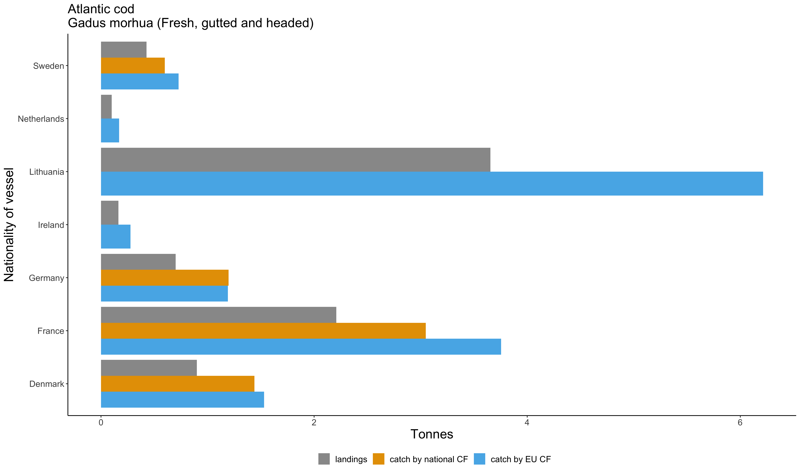

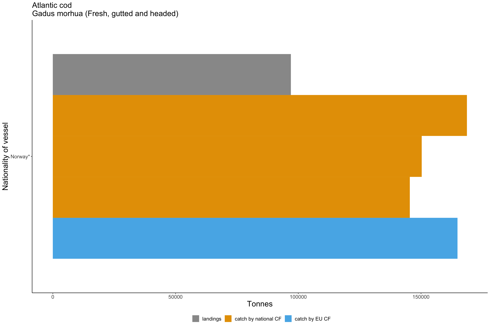

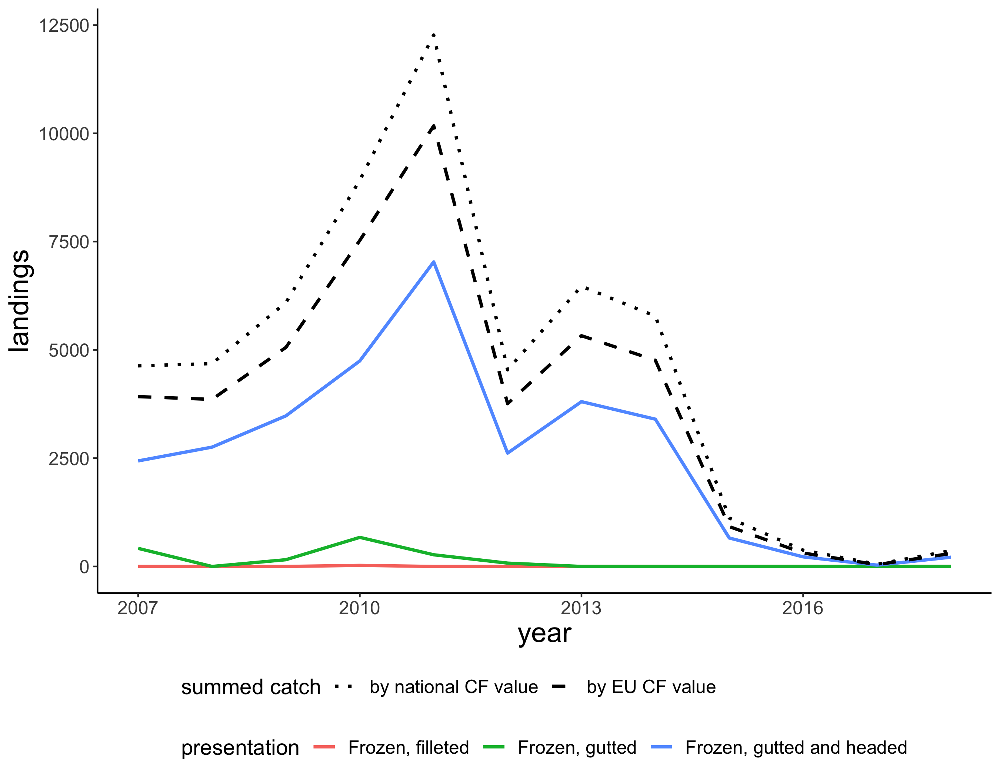

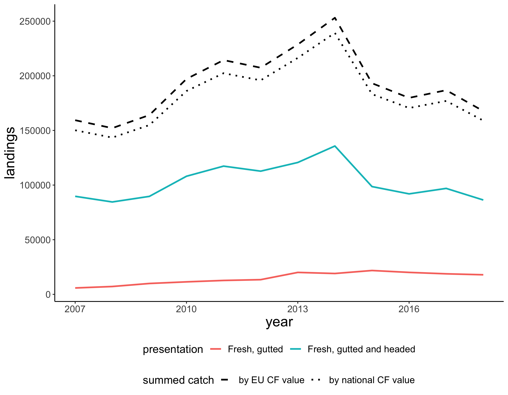

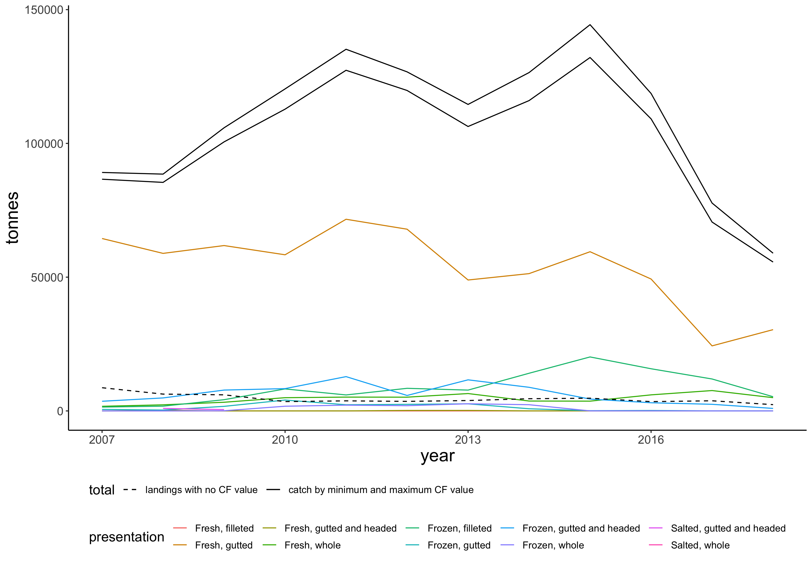

### Hake (*Merluccius merluccius*)

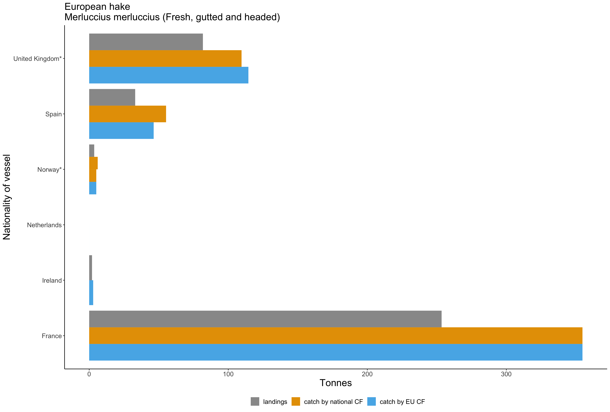

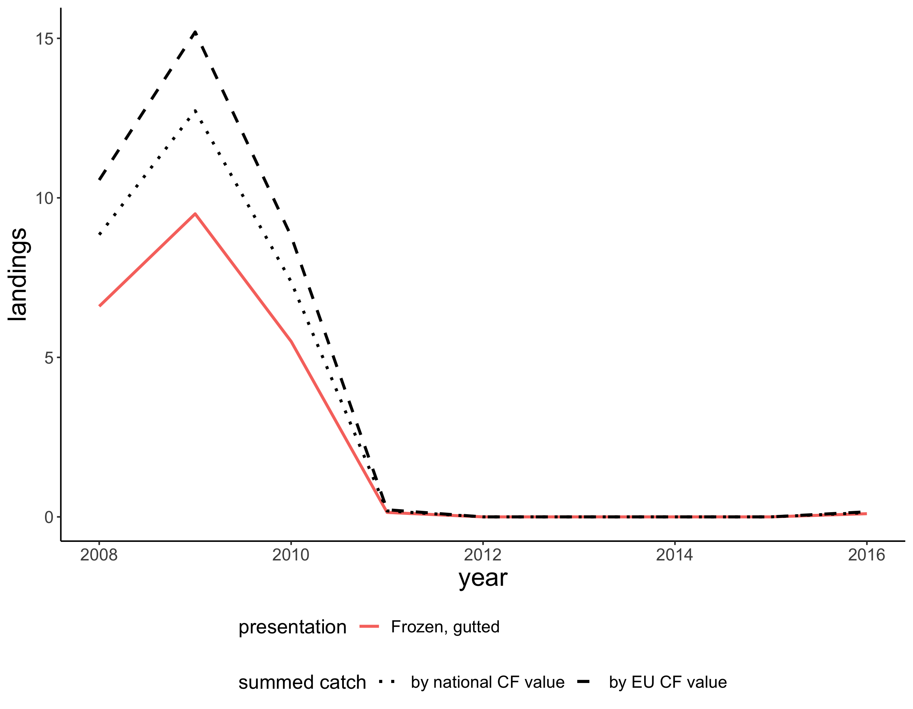

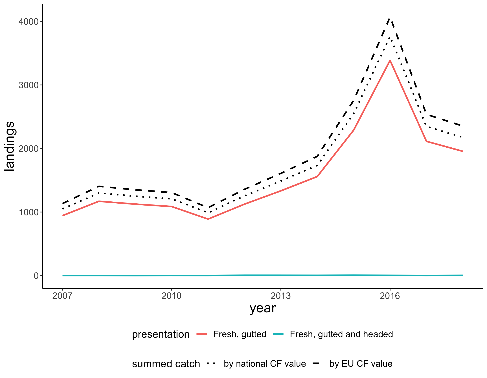

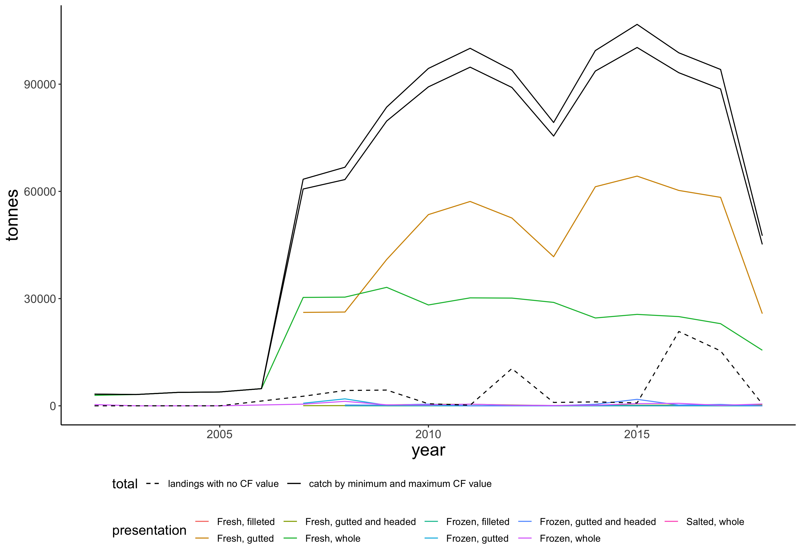

### Monkfish (*Lophiidae*)

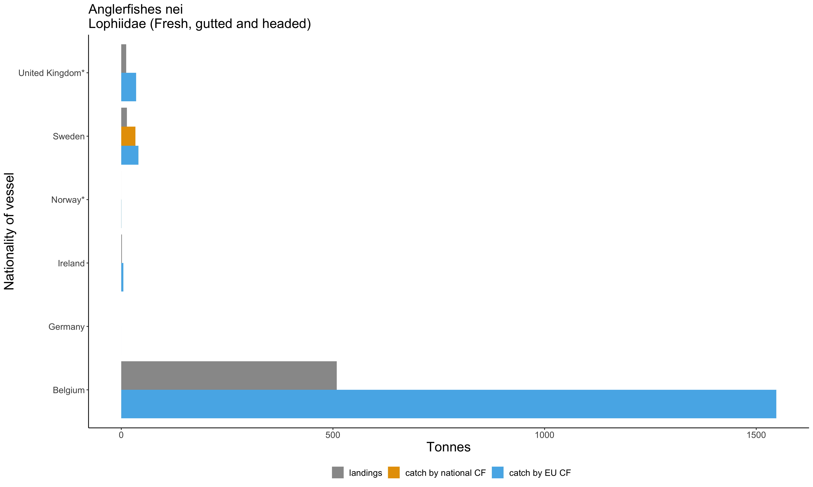

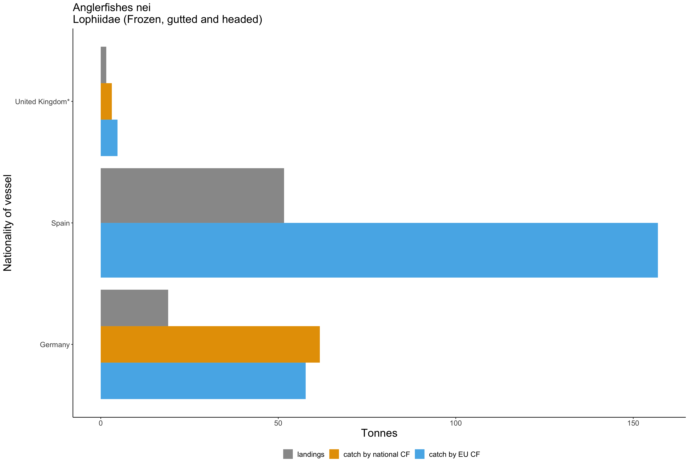


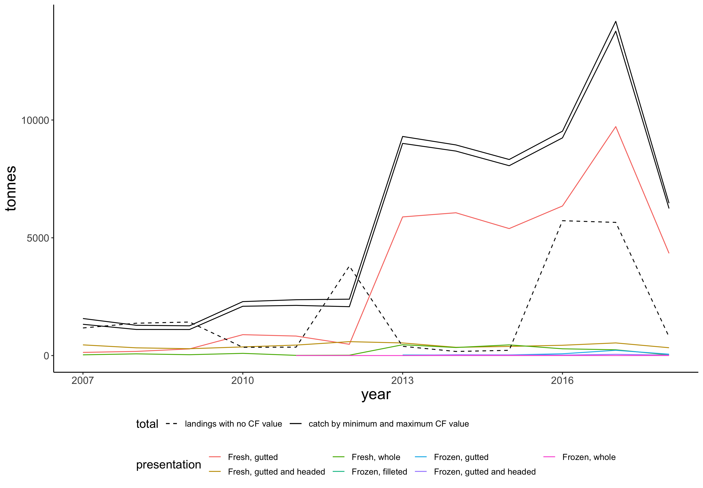


## Live weight equivalents for traded seafood

Estimating the live weight equivalent of catch from trade data is important for calculating the apparent consumption of seafood in a country and for monitoring the effects of implemented trade policies on foreign nations. While the above sections detail the uncertainties associated with converting landings data to the live weight equivalent, there are additional challenges with estimating the live weight equivalent based on trade data. Specifically, there are two main issues. First, commodity codes often include more than one species, which may differ in size and shape, and therefore, their appropriate live weight conversion factor (Figure 12). Second, while commodity codes do specify the presentations and states, they may include multiple presentations and states which vary in their live weight conversion factor (Figure 12). For example, the "whole fresh fish" category may include multiple landed presentations, such as headed or gutted. Related to this last issue, the majority of live weight conversion factor data that is available is for converting landings to the live weight equivalent catch. As a result, estimating the live weight equivalent of traded products involves not only resolving the uncertainty in the landed live weight conversion factors, but also identifying the likely mix of species and presentations that fall within a code. To address this issue, the European Union maintains detailed live weight conversion factors that are matched to trade CN-8 codes through the European Market Observatory for Fisheries and Aquaculture Products (EUMOFA) (EUMOFA 2019). This data does include information on the assumptions used to determine the live weight conversion factor for many codes, which is valuable for transparency. Even with the best documentation though, single point values for live weight conversion factors will be unable to capture changes in the species mix or presentation within a product code. 

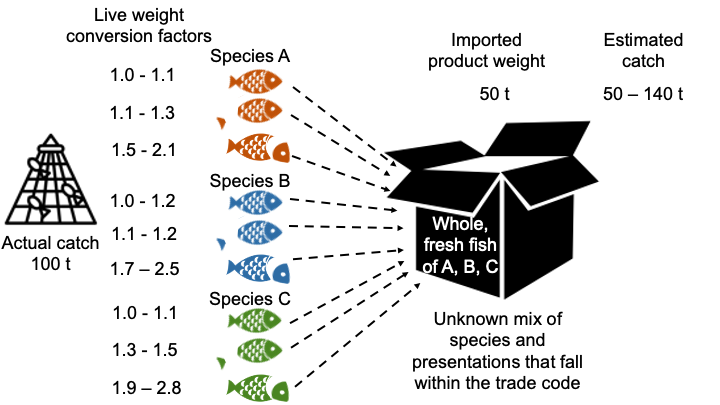

To illustrate this issue, we calculated the estimated live weight equivalent of "[code description]" (HS 030354) exported from South Korea to the EU in 2018 based on a range of plausible live weight conversion factors. Specifically, we compare the estimated live weight using South Korea's value for frozen, gutted chub mackerel (*Scomber japonicus*), using the minimum and maximum chub mackerel value from other countries, using the minimum and maximum value of other species and presentations within this code, and using the EUMOFA value. 


## Catch Statistic Terminology

Eurostat, the statistical office of the European Union, houses the catch data within the Agriculture and fisheries division. Eurostat is a member organization of the Coordinating Working Party on Fishery Statistics (CWP) and therefore has adopted the CWP catch statistic concepts and definitions. Therefore, here we compare the terminoligy on the EU catch certificate to the CWP terminology. 

The European Union Catch Certificate includes fields for reporting catch, transhipment, and import weight: 

* Catch - Estimated live weight (net fish weight in kg) 
* Catch - Estimated live weight to be landed (net fish weight in kg) 
* Catch - Verified Weight Landed (net weight in kg) 

The "Catch - Estimated live weight to be landed" field is intended for cases where all fish from one landing is
exported to the EU in one consignment while The "Catch - Estimated live weight" applies to all other situations where, for example, fish is exported live, only part of the landed catch is exported or the flag State processes the product prior to exporting it to the EU. The validating authority of the flag State then completes the “Verified Weight Landed” field, if available.

Within the CWP, net weight refers to the landed weight, not the nominal catch. The EU catch certificate fields "Estimated live weight" and "Estimated live weight to be landed" include estimated live weight (nominal catch) in the main field name, but specify "net fish weight in kg" in the parentheses. This inconsistency in terminology could provide confusion as to whether the field represents nominal catch weight or net weight. 

An additional issue related to the terminology is that the Commission implementing regulation (EU) No 404/2011 states "The fish live weight shall be obtained by multiplying the fish processed weight by the conversion factors referred to in Article 49 of this Regulation for each species and presentation." This guidance includes the the term "fish processed weight," which is not the term used on the catch certificate.

[Add note about amendment to these terms]

## Recommendations for Harmonizing Catch Statistics

Reliable catch data is essential for many fishery management and monitoring systems around the world. Catch certificates, including the EU's catch certificate program, represent an important step for tracking catch volumes. In order for the information collected on catch certificates to be maximally valuable, the data processing should be fully reproducible, which includes clafirying certificate terminology (described in the previous section) and reporting live weight conversion factors applied. 

First, the catch certificates should include a field to record the CF value applied. In principle, the conversion factor applied could be derived when both the estimated live weight and the net weight are recorded. Given that the conversion factor represents a critical assumption in the calculation, providing the conversion factor directly would simultaneously make this assumption more transparent and would allow for the live weight calculation to be checked for potential errors. This is especially important in the cases of multiple presentations, where it would be very difficult to guess the conversion factor applied, as the the guidance indicates that "In case of collective presentations, only one conversion factor corresponding to one of the parts of the collective presentation of a fish shall be used."

Second, the live weight converson factors applied to landings data should ideally be reported with the landings data to all data users to convert between the landings and catch data. Catch data is currently aggregated by species, while the landings data is reported by species, presentation, state combinations. Without knowing the live weight conversion factors applied to each species, presentation, state combination, a data user cannot convert between the two data sources. Alternatively, catch data could be reported in terms of the live weight equivalent by species, presentation, state combination, which would allow the apparent live weight conversion factor to be calculated. 


* Need for EU-wide CF for all species/presentations -- there are cases where a country says to use the EU wide value for a species, but the EU does not provide a value for all states/presentations
* Mismatch between landings data states and presentations. Need better definitions for the states and presentations. Not fully hierarchical, salted appears as a state and a presentation, and some states (e.g., cooked) don't appear on the state code list at all

## References

Agnew, D.J., Pearce, J., Pramod, G., Peatman, T., Watson, R., Beddington, J.R. and Pitcher, T.J., 2009. Estimating the worldwide extent of illegal fishing. PloS one, 4(2), p.e4570.

Carruthers, T.R., Walters, C.J. and McAllister, M.K., 2012. Evaluating methods that classify fisheries stock status using only fisheries catch data. Fisheries Research, 119, pp.66-79.

Chapsos, I. and Hamilton, S., 2019. Illegal fishing and fisheries crime as a transnational organized crime in Indonesia. Trends in Organized Crime, 22(3), pp.255-273.

EUMOFA, 2019. Metadata 2: Data Management Annex 7 - Conversion factors by CN-8 codes from 2001 to 2019. European Commission. Brussels, Belgium.

Ewell, C., Cullis-Suzuki, S., Ediger, M., Hocevar, J., Miller, D. and Jacquet, J., 2017. Potential ecological and social benefits of a moratorium on transshipment on the high seas. Marine Policy, 81, pp.293-300.

Gaulier, G. and Zignago, S., 2010. "BACI: International Trade Database at the Product-Level. The 1994-2007 Version," CEPII Working Paper 2010- 23, October 2010, CEPII.

Miller, E.A., McClenachan, L., Uni, Y., Phocas, G., Hagemann, M.E. and Van Houtan, K.S., 2019. The historical development of complex global trafficking networks for marine wildlife. Science advances, 5(3), p.eaav5948.


## Appendix


