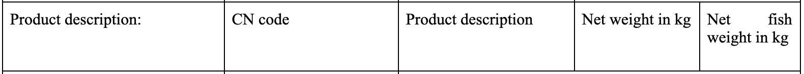

## Notes

* Q for Kelvin - did we pull the Norway, Greenland and Faroe Island values (they are separate here: <https://ec.europa.eu/fisheries/cfp/control/conversion_factors_en>)

## Info from contract [remove from report]

### Background

The Environmental Justice Foundation, Oceana, The Nature Conservancy, The Pew Charitable Trusts and WWF are working together in a coalition (the ‘EU IUU Coalition’) to improve global fisheries governance and transparency to end illegal, unreported and unregulated (IUU) fishing. In order to stop IUU fishing, traceability and transparency of the seafood supply chain is key. Therefore, an important goal of the EU IUU Coalition’s work is to improve traceability and verification of the legality of seafood landed or imported into the European Union (EU). 

The inconsistent use of conversion factors and presentation codes for processed fish, that are used to convert fish processed weight into fish live weight for the purpose of monitoring catches, has been identified as a weakness in seafood traceability systems, where it is suspected “missing landings” go unreported, at EU and at global level. 

Conversion factors set at EU level
Commission implementing regulation (EU) No 404/2011 establishes fresh and fresh salted EU conversion factors and presentation codes that are currently being used. The implementing regulation currently applies to fishery products on board or landed or transhipped by EU fishing vessels and by third country vessels fishing in EU waters.  However, this regulation will soon be revised following the revision of the EU’s fisheries Control Regulation. This presents an opportunity for the adoption of improved factors and codes, as well as improved measures and guidelines for their use. 

Conversion factors set at Member State level
In cases where no EU or regional conversion factors exist for a given species and presentation, the conversion factor adopted by the flag Member State applies. 

Conversion factors set at RFMO level
In situations where Regional Fisheries Management Organisations (RFMOs), of which the EU is a Contracting party or cooperating non Contracting party, or regions or coastal areas where the EU has an agreement to fish in third country waters, have defined regional conversion factors, these factors apply. 

Conversion factors of imports from third countries outside RFMO areas
The EU cannot require non-EU countries to use the conversion factors set by the EU, and imports into the EU (with the exception of species with a conversion factor at RFMO level) thus use the conversion factors of the vessel’s flag country, with the result that with regards to imported seafood, conversion factors used may vary even more widely. In the EU catch certificate accompanying imported seafood there are data fields for “Estimated live weight (net fish weight in kg)”; “Estimated live weight to be landed (net fish weight in kg)”; and “Verified weight landed (net weight in kg)”; however there is no data field indicating the conversion factors used in these calculations.

### Purpose

The purpose of the expert contract is to assist the EU IUU Coalition in raising awareness about conversion factors, explaining in simple terms the issues that could arise in back-calculating live weight with numerous conversion factors. The issue of conversion factors is not often discussed and this factsheet would serve to try to kick-start a public debate. Depending on the issues revealed, we would use the factsheet to push the European Commission to develop, adopt and/or require the use of harmonised conversion factors to ensure that the reported live weight of fish recorded on landing declarations accurately reflects the catches made on board fishing vessels. In addition, the factsheet would serve to highlight the difficulties of inspecting imports of non-RFMO species that could arrive in EU ports without information on the conversion factor used. 

### Outputs and deliverables

The expert will develop and deliver to the EU IUU Coalition a short background report and a 2-3-page factsheet, informed by the report: 

1.	demonstrating how inconsistencies in how the live weight of fish is calculated leads to “missing landings” of processed seafood landed in the EU, i.e. a simple case study showing the difference between EU and Member State conversion factors and how this could impact catch estimates; 
2.	demonstrating how a lack of information on third country conversion factors (non-RFMO species) could impact the back-calculation to live weight, i.e. a simple analysis could be undertaken for one key import species, showing the different conversion factors used in three key importing states;
3.	identifying what the strengths and/or weaknesses are in the use of terminology “Estimated live weight (net fish weight in kg)”, “Estimated live weight to be landed (net fish weight in kg)” and “Verified weight landed (net weight in kg)” as data fields on the catch certificate for seafood imports; and
4.	providing policy recommendations on the best way to estimate weights and potentially harmonise conversion factors so they accurately reflect catches made on board fishing vessels, to the greatest extent possible.

### Audience

The short background report, from which the factsheet is directly derived, will serve for the EU IUU Coalition internally to respond to follow-up queries on the factsheet from the target audience.

### To do

* Draft report due August 31, 2020
* Week of August 24: Draft review between JG and KG
* Week of August 17: Tentatively scheduled update with EJF team, have draft figures ready to present
* Output 1: Summary of variation in CF values for a given species - presentation - preservation combo across different member and non-member states and EU-wide
* Output 2: Identify a case-study where there is large CF-variation. Use EUROSTAT landings data to show range of live weight equivalent over time using different CF values
* Week of August 3: Work on harmonization recommendations (JG); Create figures for case studies (KG)
* Week of July 27: Select case studies, work on terminology recommendations
* Week of July 20: All data entered (Have CF values entered into spreadsheet)

Notes for interview: <https://docs.google.com/document/d/1o2wUMDMseYWBAx70J8Kq6zYFJVtCsX-Vcl-XEuk3ZDE/edit?usp=sharing>

```{r setup, include=FALSE}
knitr::opts_chunk$set(echo = TRUE)
```

## Summary


## Introduction

High quality catch data is a pillar of fisheries management around the world. Catch data is central to enforcing quota systems and is a critical input to fisheries management models, both to understand the biomass removed from the population and as an indicator of the stock health. While stock assessments remain the gold standard for evaluating the sustainability of a fishery, full stock assessments are cost-prohibitive in many locations and at the frequency necessary. Catch data therefore remains a critical input piece of data for data-poor stock assessment and when paired with with fishing effort, serves as an indicator of catch sustainability (REF). [Point about FAO use of catch data] 

Illegal, unreported and underreported (IUU) fishing produces an underestimate of catch therefore distorting information on fish harvest relative to target sustainable levels and trends in catch used to understand stock sustainability. [General problem of IUU (define, describe magnitude, pathways and importance of traceability)]

Another key issue affecting the quality of catch data are live weight conversion factors. In general, the weight of fish caught is not measured directly. Instead, catch is typically estimated by multiplying the weight of fish landed, often after some amount of processing (e.g., removal of head or guts) that reduces the weight, by a "live weight conversion factor". For example, 1000 tonnes of landed fish with an associated live weight conversion factor of 1.2 would result in an estimated 1200 tonnes of catch. Converting landings to the live weight equivalent is necessary because patterns in landed weight will vary substantially with differences in processing prior to landing. The resulting live weight equivalent of the landed weight serves as the catch estimate reported in standard international databases. 

Noteably, seemingly small numerical differences in live weight conversion factors can result in large differences in estimated catch. For example, if we take the 1000 tonnes of landed fish from above and instead apply a live weight conversion factor of 1.8, we would estimate 1800 tonnes of catch, or an additional 600 tonnes. As discussed later in this report, live weight conversion factors for a single product can vary substantially more than in this example. Yet, despite the fact that applying different live weight conversion factors will substantially shift the estimated catch, live weight conversion factors are not generally reported alongside estimated catch. Further, once catch is aggregated by species or taxonomic group, the information on processing at landing is lost, making it impossible to reestimate catch using a different set of live weight conversion factors from the catch data alone. As a result unreporeted live weight conversion factors represent a set of critical underlying assumptions in catch data that inhibit data reproducibility and transparency. 
Further, this assumption [connection to IUU]

Following the FAO Coordinating Party on Fishery Statistics, within this report, the landed weight refers to the weight of product at the time of landing, regardless of the state (e.g., fresh or frozen) and presentation (e.g., whole, gutted, filleted, etc.), the product weight refers to the weight of a product at the time of weighing, and the nominal catch refers to the landings converted to a live weight basis (Ref: <http://www.fao.org/cwp-on-fishery-statistics/handbook/capture-fisheries-statistics/catch-and-landings/en/>). Since fishery products can be landed in diverse states and presentations, which dramatically alter the weight, catch statistics are reported as nominal weight in international statistics. In order to convert from landed weight to nominal weight, a live weight conversion factor must be applied. The conversion to nominal weight enables better catch comparison across space and time since it incorporates differences in state and presentation. At the same time, the application of live weight conversion factors can introduce error when the factors do not accurately represent processing losses. Additionally, nominal catch only represents the live weight equivalent of the fishery products landed and therefore cannot be used to directly evaluate the gross catch, which includes not only the retained catch, but also the discarded catch. 

* EU catch certificate program


* State key issues addressed in factsheet


## EU Catch Certificate

Commission implementing regulation (EU) No 404/2011

## EU Member State Conversion Factors

* Commission implementing regulation (EU) No 404/2011 relating to Member States
* Summarize the range in CFs

Figure 1: Range of live weight conversion factors by species, state and presentation. Differentiation of EU-wide value, EU Member State value and non-EU Member State value

### Case study 1: EU Member State example

Figure 2: Use landed weight data to show variation in calculated live weight using different CF's for EU value compared to Member State(s)

## Non-EU Member State Conversion Factors

* Commission implementing regulation (EU) No 404/2011 relating to non-Member States
* Summarize the range in CFs

### Case study 2: EU-non-member comparison

Figure 3: Use landed weight data to show variation in calculated live weight using different CF's for member and non-member States

## Trade Code Alignment with Conversion Factors

Figure 4: Range in CFs by HS code (probably for select illustrative codes)

## Other Considerations

* Change over time
* True variability in CFs due to differences in processing technology

## Catch Statistic Terminology

Eurostat, the statistical office of the European Union, houses the catch data within the Agriculture and fisheries division. Eurostat is a member organization of the Coordinating Working Party on Fishery Statistics (CWP) and therefore has adopted the CWP catch statistic concepts and definitions. Therefore, here we compare the terminoligy on the EU catch certificate to the CWP terminology. 

As described above, catch statistics are reported as the live weight equivalent, which differs from... The CWP defines are nominal catch, landed weight, product weight, and discards. 

The European Union Catch Certificate includes fields for reporting catch, transhipment, and import weight: 

* Catch - Estimated live weight (net fish weight in kg) (Fig _)
* Catch - Estimated live weight to be landed (net fish weight in kg) (Fig _)
* Catch - Verified Weight Landed (net weight in kg) (Fig _)
* Transhipment - Estimated weight (kg) (Fig _)
* Import - Net weight in kg (Fig _)
* Import - Net fish weight in kg (Fig _)

Within the CWP, net weight refers to the landed weight, not the nominal catch. The EU catch certificate fields "Estimated live weight" and "Estimated live weight to be landed" include estimated live weight (nominal catch) in the main field name, but specify "net fish weight in kg" in the parentheses. 

Check if estimated live weigh includes discards

FIXIT: Check that these forms are the correct forms corresponding to the Commission implementing regulation (EU) No 404/2011


Figure _: Annex II European Union Catch Certificate and Re-Export Certificate catch weight fields


Figure _: Annex II European Union Catch Certificate and Re-Export Certificate transhipment weight fields


Figure _: Annex II European Union Catch Certificate and Re-Export Certificate trade weight fields

States "The fish live weight shall be obtained by multiplying the fish processed weight by the conversion factors referred to in Article 49 of this Regulation for each species and presentation." but the term "fish processed weight" is not the same term used on the catch certificate.

## Recommendations for Harmonizing Catch Statistics

* For data reproducibility:
* Landings certificate should collect CF values. This is especially important in the cases of multiple presentations, where it would be very difficult to guess the CF applied ("In case of collective presentations, only one conversion factor corresponding to one of the parts of the collective presentation of a fish shall be used.")
* CF values applied to back-calculate live weight should be reported with the catch data (currently unable to back-calculate CF values from historical catch and landings because fish are landed in multiple presentations which can't be paired back to total catch which does not record original landed presentations)
* Alternatively, catch data should report original landed presentation, and from this one could back-calculate the applied CF value
* Need for EU-wide CF for all species/presentations -- there are cases where a country says to use the EU wide value for a species, but the EU does not provide a value for all states/presentations
* Mismatch between landings data states and presentations. Need better definitions for the states and presentations. Not fully hierarchical, salted appears as a state and a presentation, and some states (e.g., cooked) don't appear on the state code list at all
* 
